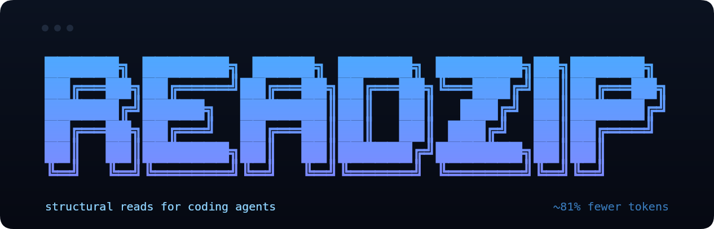

<div align="center">
  

  <h2>High-performance file-read CLI for AI coding agents</h2>
  <p><i>~80% fewer tokens on large files. Zero new tools to learn.</i></p>

  <p>
    <a href="https://github.com/rishiskhare/readzip/actions"></a>
    <a href="https://github.com/rishiskhare/readzip/releases/latest"></a>
    
    
    
  </p>
</div>

readzip parses large source files with tree-sitter and returns a structural skeleton — symbols + exact line ranges — instead of dumping the full source. Single Rust binary, 16 supported languages.

## Token savings (real measurement on this repo)

| File | Lang | Lines | Original tokens | Skeleton tokens | Savings |
|---|---|---:|---:|---:|---:|
| `crates/readzip-cli/src/main.rs` | Rust | 1,086 |  9,561 | 1,199 | **−87.5%** |
| `crates/readzip-core/src/lib.rs` | Rust |   941 |  7,917 | 1,276 | **−83.9%** |
| **Total** |     | 2,027 | 17,478 | 2,475 | **−85.8%** |

Across files over 500 lines, average reduction is **~80%**. Run `readzip stats` after a session to see your actual numbers.

## Install

### One-line install (Linux / macOS)

```bash
curl -fsSL https://raw.githubusercontent.com/rishiskhare/readzip/main/install.sh | sh
```

The installer fetches a pre-built binary, drops it in `~/.local/bin`, and auto-wires the Claude Code `PreToolUse` hook if Claude Code is installed. (For Codex, it also drops an `AGENTS.md` snippet so the agent knows about the CLI commands.) No `init` step required. Restart your AI tool and you're done.

### Cargo

```bash
cargo install --git https://github.com/rishiskhare/readzip readzip-cli
```

### Pre-built binaries

Download from [releases](https://github.com/rishiskhare/readzip/releases):

- macOS: `readzip-x86_64-apple-darwin.tar.gz` / `readzip-aarch64-apple-darwin.tar.gz`
- Linux: `readzip-x86_64-unknown-linux-gnu.tar.gz` / `readzip-aarch64-unknown-linux-gnu.tar.gz`

## Verify

```bash
readzip --version    # readzip 0.1.0
readzip doctor       # confirms the Claude Code hook is wired up
readzip stats        # tokens saved so far (zero on a fresh install)
readzip demo         # see compression on a 492-line bundled fixture
```

## Quick start — Claude Code

After install, restart Claude Code. The hook intercepts native `Read` calls on files >500 lines and returns a tree-sitter skeleton instead of the full source. The agent picks the section it wants and re-reads with `offset`/`limit`. Nothing else to configure.

```text
$ readzip stats

  files intercepted:    14
  tokens saved:         87.4K
  avg reduction:        82.3%
  cache dir:            ~/.cache/readzip
```

## Quick start — any other agent (Codex, Cursor, Cline, Windsurf, Gemini, Aider, …)

readzip is also a regular CLI. Tell your agent it has these commands available; it can call them from Bash like any other utility:

```bash
readzip read <file>                       # smart cat: skeleton if large, full if small
readzip section <file> <offset> <limit>   # scoped slice (1-indexed lines)
readzip skeleton <file>                   # always print the skeleton
```

That's the whole API surface for non-Claude agents. No setup, no special tool registration, no protocol shim — just three Bash commands. Same compression as Claude Code; the difference is the agent invokes it explicitly instead of being intercepted.

```bash
$ readzip read crates/readzip-core/src/lib.rs
# crates/readzip-core/src/lib.rs -- 924 lines (Rust) skeleton view
L1-7    imports / module header
L14-21  struct pub struct Config
L184-187  fn build_skeleton(path: &Path, config: &Config) -> io::Result<Skeleton>
L227-313  fn cached_skeleton(path: &Path, config: &Config) -> io::Result<Skeleton>
... (full output truncated)

$ readzip section crates/readzip-core/src/lib.rs 184 4
   184  pub fn build_skeleton(path: &Path, config: &Config) -> io::Result<Skeleton> {
   185      let source = fs::read_to_string(path)?;
   186      Ok(build_skeleton_from_source(path, &source, config))
   187  }
```

## What gets a skeleton vs. what passes through

| Read call | Behavior |
|---|---|
| Source file ≥ 500 lines, no offset/limit | **Skeleton + deny** (Claude) or **skeleton on stdout** (CLI). |
| Source file < 500 lines | Full content. |
| Scoped `Read(path, offset=N, limit=M)` | Full content for the requested range, regardless of file size. |
| Binary file (`.png`, `.so`, etc.) | Full content. |
| Unknown extension (`.txt`, `.log`, `.csv`) | Full content. |
| Files in `force_full_for` (`*.md`, `package.json`, …) | Full content. |
| Files with zero top-level symbols (config-style, all-constants) | Full content. |

**Every byte of every file is still reachable.** readzip never blocks content — it just inserts a structural signpost on the first read of large source files.

## Supported languages

readzip uses **tree-sitter** — the same incremental parser GitHub, Neovim, Helix, and Zed use — for symbol extraction across:

| | | | |
|---|---|---|---|
| Python | JavaScript | TypeScript | Go |
| Rust | Java | Ruby | C |
| C++ | C# | PHP | Swift |
| Kotlin | Scala | Lua | Bash |

Symbol end-lines come from the actual closing-brace position in the parse tree, not indent heuristics. When tree-sitter parses a file with > 5% `ERROR` / `MISSING` nodes (broken or partially-edited source), readzip falls back to a line-prefix heuristic so you always get *something*. Adding a 17th language is a 4-file PR — see [docs/adding-a-language.md](docs/adding-a-language.md).

## Supported AI tools

| Agent | How it uses readzip |
|---|---|
| **Claude Code** | Transparent — the `PreToolUse` hook intercepts native `Read` automatically. Auto-wired by `install.sh`. |
| Codex | CLI commands above. `install.sh` drops an `AGENTS.md` snippet at `~/.codex/readzip-AGENTS-snippet.md` so the agent learns about them. |
| Cursor / Cline / Windsurf / Gemini CLI / Aider / OpenCode / anything with shell access | CLI commands above. **No setup.** Just tell the agent the three commands exist and it'll use them when reading source. |

readzip is a single-purpose CLI by design — no MCP server, no agent-specific protocol shim, no plugin to load. If your agent can run Bash, it can use readzip.

## Commands

```bash
# Primary
readzip read <file>                      # smart cat: skeleton if large, full if small
readzip section <file> <offset> <limit>  # scoped line range
readzip skeleton <file>                  # always print the skeleton
readzip stats [--json]                   # tokens saved so far

# Diagnostics
readzip doctor [--json]                  # Claude hook + Codex hint status
readzip demo [--json]                    # bundled fixture
readzip --version

# Install / uninstall
readzip init [--yes]                     # auto-run by install.sh; rerun if needed
readzip uninstall [--keep-cache] [--purge]  # --purge also wipes ~/.config/readzip

# Advanced (rarely run by hand)
readzip hook                             # PreToolUse handler — Claude Code calls this
```

## Configuration

`~/.config/readzip/config.toml`

```toml
min_lines = 500              # files smaller than this pass through
max_skeleton_tokens = 1500   # cap skeleton size
skeleton_detail = "medium"   # minimal | medium | verbose
bypass_for = []              # globs that always pass through
force_full_for = ["*.md", "package.json"]
```

Force a specific file to always pass through:

```toml
bypass_for = ["src/generated/schema.rs", "vendor/**"]
```

## Stats

Local-only. Always recording. No network calls, ever.

```bash
readzip stats
```

Each intercepted Read appends one line to `~/.cache/readzip/stats.tsv` recording timestamp, hashed file path, original token estimate, and skeleton token estimate. The hashed path is a 64-bit Rust `DefaultHasher` digest, never the original path. To wipe: `rm ~/.cache/readzip/stats.tsv`.

## Performance

Per-`Read` overhead measured on macOS arm64:

| Path | Latency |
|---|---:|
| Non-Read tool / scoped Read / passthrough | ~30 ms |
| Large file intercept, **cold cache** | ~60 ms |
| Large file intercept, **warm cache** | ~30 ms |

The ~30 ms floor is the cost of spawning a 28 MB Rust binary that links 16 tree-sitter grammars. Compared to Claude Code's LLM round-trips at 1-3 seconds, this is **~1-3% overhead per Read** — indistinguishable from noise in real sessions.

## Uninstall

One-liner, symmetric with install:

```bash
curl -fsSL https://raw.githubusercontent.com/rishiskhare/readzip/main/uninstall.sh | sh
```

Manual:

```bash
readzip uninstall              # hook + Codex hint + cache
readzip uninstall --purge      # also delete ~/.config/readzip/
rm -f ~/.local/bin/readzip     # delete the binary
```

`readzip uninstall` writes `.bak` files of every settings.json it touches before editing, so you can restore with `mv ~/.claude/settings.json.readzip-bak-* ~/.claude/settings.json` if needed.

## Privacy

100% local. Tree-sitter parses on disk; no network calls, ever. No telemetry. Stats live at `~/.cache/readzip/stats.tsv` and never leave your machine. The `readzip hook` and CLI commands run entirely in-process under your user, with the same filesystem privileges as the agent itself.

## License

MIT — see [LICENSE](LICENSE).
